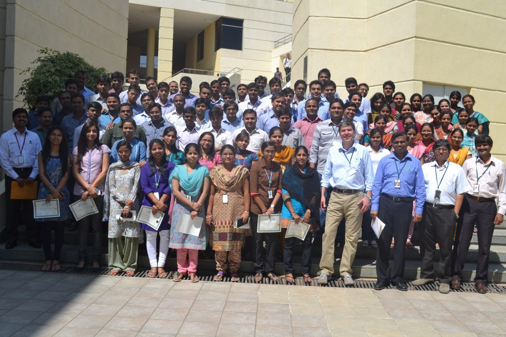
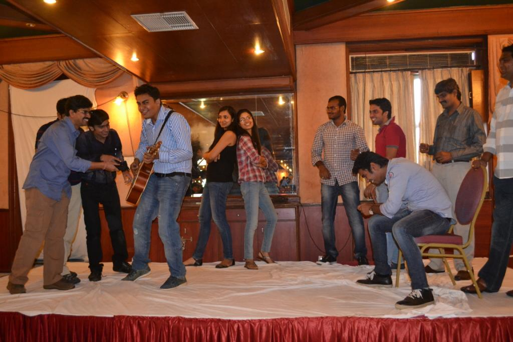

# Adios... Wipro & Microsoft family!

Hello Everyone,

It has been a humbling and a very fruitful two years of my career with Wipro Technologies, wherein I was given opportunities and responsibilities that have helped me to grow both professionally and personally. Thank you, **Krishna**, for having faith in me. A special thanks to AppCompat Leadership team especially **Rajiv** & **Ankit** for being my motivator. 

In any organisation, you make a set of friends who guide you, feel happy for your success and will bitch about the person whom you have an issue with \(:P\) I was lucky to have these people who made the journey at Wipro a fun filled one. **Yogesh, Prerna, Swapna, Pratik, Sivarama Krishna, Vishwanath, Sharath, Swathi, Uma, Himanshu, Rahul** and my dear cubical mates thank you all for all the fun we had and will miss the fun what we had.

I'd like to take this opportunity to thank you each one of you for your corporation and, support during my tenure at Wipro. Please kindly accept my apologies for any mistakes or hard feelings that may have happened during my tenure. Thanks for everything. 🙂

I wish you all the best in finishing and shipping Windows Next!

