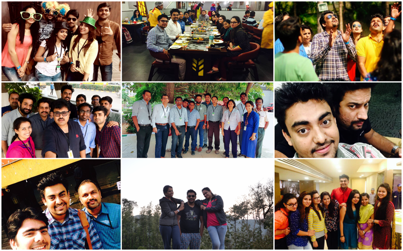

# My Time has arrived

As most of you would know. **26th May 2017** is my last day at IDC \(now ATCI\), I am moving to Accenture UK. I want to take this opportunity to thank you for the all achievement we have made together. 

You have been a very versatile team. I am very honest with this one. Despite all footraces, we have managed to build a close knit homogeneous team that always up to take a challenge. I am very proud of you and the way we have developed. The journey in these last 27 months had been the most amazing, fulfilling, educating and above all the ‘most cherished’ one. I feel extremely privileged having gotten the opportunity to know and work with so many talented individuals from diverse backgrounds who are so welcoming and friendly. It has truly been an ‘enriching life experience’ for me, Thank you one & all.  

There is a German saying which translates something like: **I am leaving with one eye crying, the other one laughing**.  This is very true. I am laughing on one side because we have managed to grow as Digital Security Agile team and we were able to deliver very important assets aka Digital Security Framework and the core offers for Mobile & Web AppSec. Those were big at least for me. I specially want to thank Kannan, & Murali for showing confidence & trust in my skills, Sunil & Ranganath who always guided me during my tenure & left an incredible impression on me over the years and I hope to carry the traits that I have gathered from you moving forward. 

Yogi, Prerna, Akanksha, & Pawan – You are being awesome as my backbone technically and morally, thx you bud. In any organisation you make a set of friends who guide you, feel happy for your success and will bitch about the person whom you have an issue with \(:P\) I was lucky to have these people who made the journey at DST a fun filled one \(Suruchi, Karan, Sri, Anil Bhai, Murali, Pradeep. etc.,\) for being with me to create a great working atmosphere and for yielding memories. 

[@Digital Security Researcher](mailto:Digital.Security.Researcher@accenture.com)  [@Digital.Security.Devs](mailto:Digital.Security.Devs@accenture.com)  - I hope you will forgive me \(not today, but some day maybe\) all the troubles I caused to you, pressure I made and maybe some harsh words that fell in the middle of the battleground. I hope you will trust me when I tell you that everything I did, I did for the wellbeing of the project and our product, and - believer or not - for yours. I also profited a lot from your youth, enthusiasm, knowledge and energy! 

Once again:  Let us rock together while defining our new mission “IOT Security & Advancing Mobile AppSec” \#Fy18

