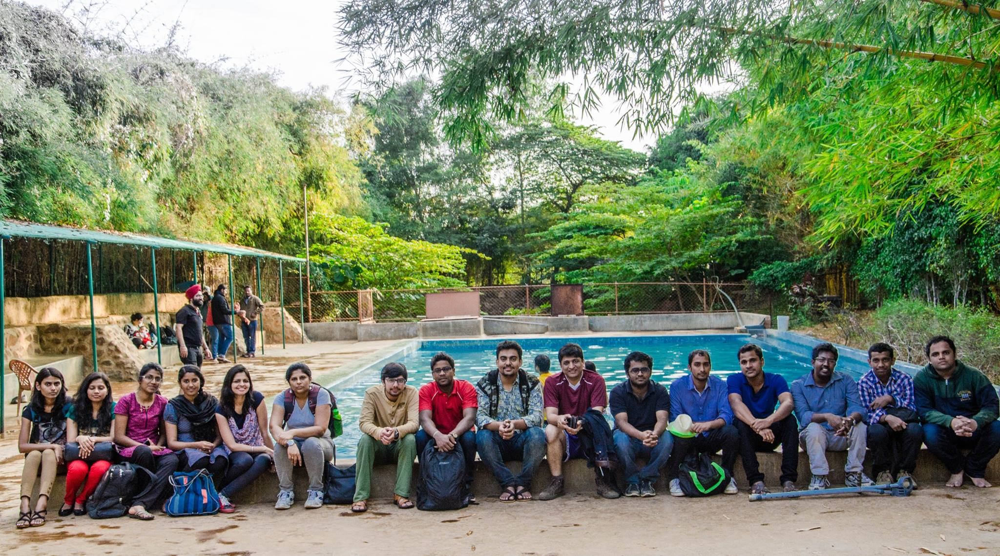

# Well, It is not the END \#Passbrains

Dears,

As some of you already know, today is my last working day at PASS Technologies \(Passbrains\).

Yes, I am moving out of the company, The journey in these last 20 months has been the most amazing, fulfilling, educating and above all the ‘most cherished’ one. I feel extremely privileged having gotten the opportunity to know and work with so many talented individuals from diverse backgrounds who are so welcoming and friendly. It has truly been an ‘enriching life experience’ for me, Thank you one & all.

On a personal note, working in PASS was the best challenge of my life till date and I always tried to deliver my best. I always felt a sense of ownership and responsibility towards designing new era of crowd security testing. Today I am happy to say that I was part of history starting from scratch to one of the biggest crowd testing SaaS platform.

I especially want to thank **Dieter** for showing confidence & trust in my skills. **Mayank** who always guided me during my tenure & left an incredible impression on me over the years and I hope to carry the traits that I have gathered from you moving forward. A very special thanks to Passbrains Platform Leadership team, especially **Johannes, Vladan, Cris** and lately **Pari**. Your leadership and ability to get things done are an inspiration to me. Thanks for having faith in me and for motivating me to grow my career strengths. I have to say that in the passbrains team everyone pitches in, and work together in perfect harmony.

Thanks Passbrains Platforms Dev Team, PMs, Cerner , Automation , HR – Operation team for being with me to create a great working atmosphere and for yielding unforgettable memories.Though I am leaving with a heavy heart, I am happy to leave for a good reason. Do give me a ring anytime you feel like. My contact number and email address will remain the same. 

Bye by Passbrains, Look forward to meeting my new friends at Accenture \#Loves \#Hugs! 🤩

