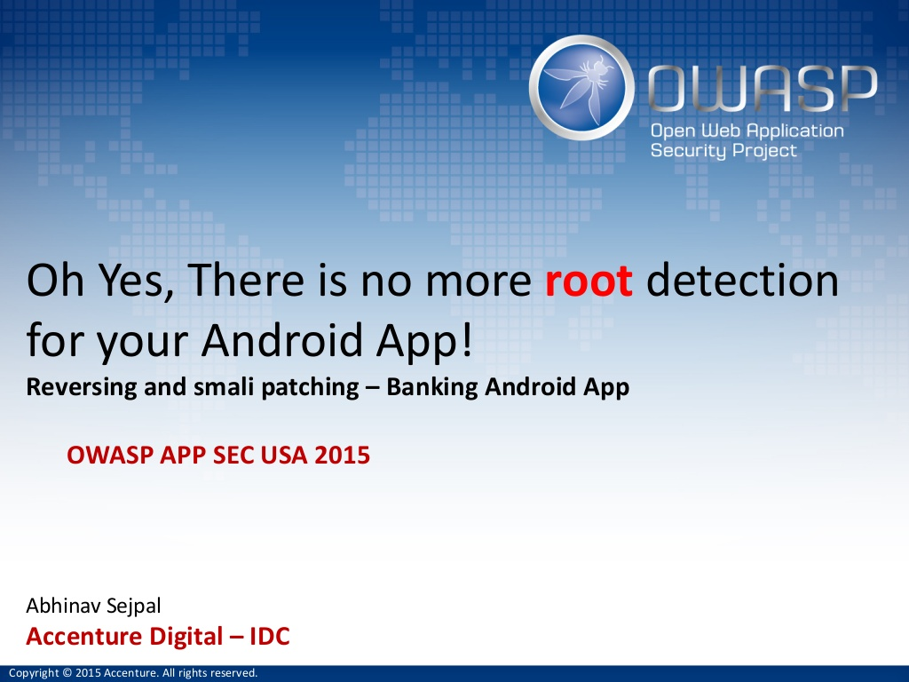

# OWASP AppSec USA

                                                                             [AppSecUSA 2015 ](https://appsecusa2015.sched.com/event/129aa2ed31755697723b8f2855ab76b9?iframe=no&w=i:100;&sidebar=yes&bg=no#.VenMMNOqrDU)

**Android** is the leading Operating system. It is used not just in Smartphones / Tablet but also is used as base for interactive Television, gaming console and lot more systems. The obvious resultant is that there is a large focus towards developing applications for this platform and to maintain its security. This is one hour crash course on “By passing root detection” on android based dummy internet banking app, This dummy internet banking application has features such as adding a beneficiary account, fund transfer, view statements, OTP, Pin sign-in, etc. to provide attendees a real world application scenario.   
  
Android APK file architecture and Setting up the emulator.  
Reversing the APK file package   
Understanding, patching smali code \(JAVA – Class – Dex – smali – APK\)  
Bypass the business logic for the root detection  
  
**Who Should Attend**  
- Security Professionals   
- Mobile Application Developers  
- People interested to start into Android security  
- Web Application Pentesters  
- Beginners mobile app malware auditor   
  
**What to expect**  
- Getting started with Android Security  
- Reversing and Auditing of Android applications  
- Hands-on on Finding vulnerabilities and patching the binary

**Presentation** : [Here](https://www.slideshare.net/abhinavsejpal/oh-yes-there-is-no-more-root-detection-for-your-android-app)

